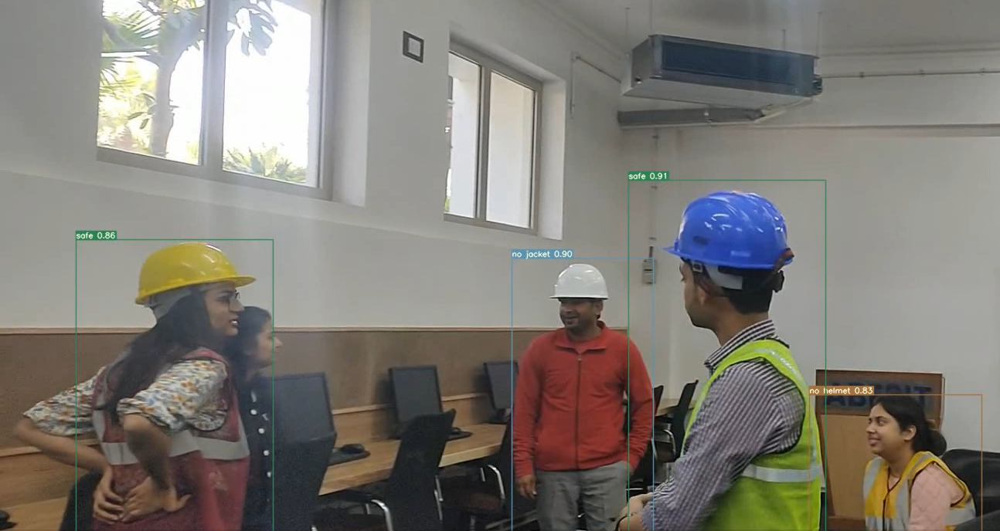
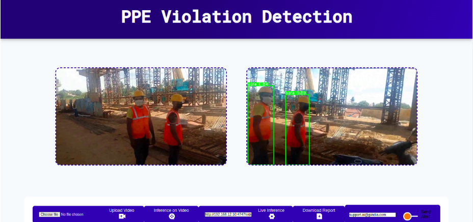
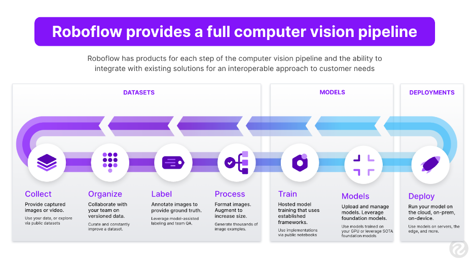
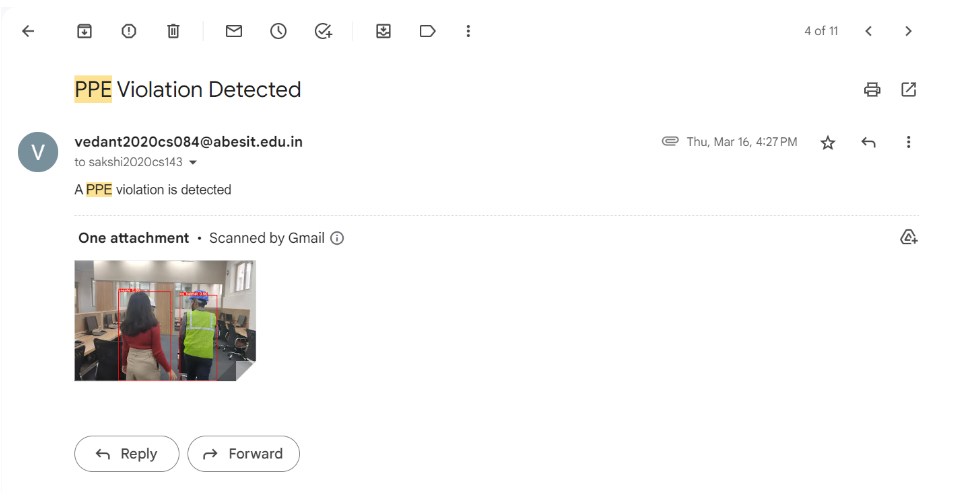

# 🛡️ PPE Violation Detection Alert System using AI 🏗️🚧
## 📄 Overview
PPE Violation Detection Alert System is an advanced AI-powered safety monitoring solution designed to enhance workplace safety at construction sites. 🏢👷 This system utilizes cutting-edge Deep Learning techniques to detect violations of Personal Protective Equipment (PPE) rules—such as missing safety helmets or jackets—by analyzing live CCTV footage. Upon detecting a violation, it immediately triggers an alert email to the site supervisor, ensuring quick corrective actions. 🚨📧

This is a Linux based project which aims to automate safety monitoring, reduce human error, and prevent accidents by ensuring compliance with safety protocols at construction sites. It’s an essential tool for improving occupational safety standards. 🦺🪖


## 🔑 Key Features
- 🎥 Real-Time Violation Detection: Monitors CCTV footage in real-time to detect any violations of PPE protocols, such as missing helmets or jackets.
- 📸 Dataset Creation: Dataset creation involved capturing real-time images from construction sites, processing, and annotating them using Roboflow. This robust and detailed dataset ensures high accuracy in violation detection.
- 📝 Advanced Dataset Annotation: Utilizes Roboflow for annotating images with precise bounding boxes and class labels, enhancing model training.
- 🚨 Alert System: Sends instant alert emails to supervisors using Gmail API when a violation is detected, ensuring timely action.
- 🧠 YOLOv7 Model Training: Utilizes YOLOv7 for training the detection model, fine-tuning weights for optimal accuracy in recognizing PPE violations.
## 🏷️ Defined Annotation Classes:
- Safe ✔️
- Unsafe ❌
- No Helmet 
- No Jacket 🦺❌

🛠️ Bounding Boxes: Detects personnel in the footage and draws bounding boxes around them, indicating whether they are following PPE rules.

📦 Deployment with Docker: The system is containerized using Docker, making deployment and scaling efficient and manageable.
## ⚙️ Tech Stack
- Python 🐍
- YOLOv7 🧩 (for object detection and training)
- Gmail API 📧 (for sending alert emails)
- Roboflow 📝 (for dataset creation and annotation)
- OpenCV 🎥 (for video processing)
- Docker 🐋 (for containerization and deployment)

## Download the model weights:-

 https://drive.google.com/file/d/1J--kK8AjDjhdaHHPrHEEB001NRRTIDd7/view?usp=sharing

## 🚀 How to Run the Project
1. Clone the Repository:
```
git clone https://github.com/Vedant3000/ppe-violation-detection.git
```
2. Make virtual environment:
```
cd PPE-Violation-Detection-Alert-System-using-AI
python -m venv venv
```
3. Activate virtual environment:
```
source venv/bin/activate
```
4. Install Dependencies:
```
pip install -r requirements.txt
```
5. Build the docker image:
```
docker build --tag <image_name> .
```
Replace <image_name> with the name of your image
6. Run the docker image in a docker container:
```
docker run --name <container_name> -p9000:5000 <image_name>
```
- Replace <container_name> with the name of your container
- Replace <image_name> with the name of your image
## View Results
The system will analyze the input from saved/live footage, highlight personnel with bounding boxes, and categorize them as Safe or Unsafe based on their PPE compliance. 🚧🛡️




## 🖥️ User Interface
Flask Web Application: The project includes an interactive Flask web interface, providing a user-friendly dashboard to monitor real-time footage, view violation alerts, and manage system settings. This interface makes the system accessible and easy to use for supervisors and safety officers.



## 📊 Model Performance
- YOLOv7 is employed for object detection, with robust performance on real-time datasets.
- Annotation Classes such as Safe, Unsafe, No Helmet, and No Jacket are defined for precise detection.
- The model is fine-tuned with specific weights to maximize accuracy, ensuring reliable detection even in challenging environments.
## 🛠️ Dataset Creation and Annotation
- Real-Time Data Collection: Images were captured directly from construction site footage to build a realistic and diverse dataset.
- Roboflow for Annotation: Images were processed and annotated using Roboflow, defining classes for safe and unsafe behaviors with clear boundary boxes.
- High-Quality Dataset: Created a comprehensive database to train the YOLOv7 model effectively, leading to highly accurate PPE violation detection.




## 📝 Alert Mechanism
Gmail API is integrated to send instant alerts to supervisors when a violation is detected. This ensures rapid response and maintains safety standards at all times. 📧🚨



## 🌟 Future Enhancements
- 🧠 Model Improvement: Further fine-tuning and incorporating additional PPE classes, like gloves and safety boots.
- 🌐 Web Interface: Developing a Flask or Streamlit web dashboard for live monitoring and alert management.
- 📈 Performance Metrics: Adding performance tracking and logging capabilities for analyzing system effectiveness over time.
